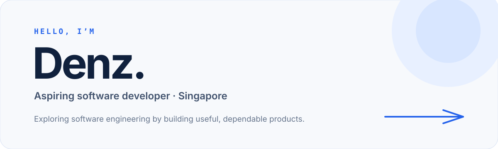

<picture>
  <source media="(prefers-color-scheme: dark)" srcset="./assets/header-dark.svg">
  <source media="(prefers-color-scheme: light)" srcset="./assets/header-light.svg">
  
</picture>

## Building to learn

I’m Denz, an aspiring software developer in Singapore. I’m exploring software engineering broadly by turning ideas into practical products, learning how the interface, application logic, and data layer fit together along the way.

Right now, I’m interested in:

- building thoughtful full-stack web experiences;
- making product decisions around real user needs; and
- understanding the reliable systems behind polished interfaces.

## Selected work

<table>
  <tr>
    <td width="50%" valign="top">
      <h3><a href="https://github.com/asurazxz/Resilience">Resilience</a></h3>
      
A team-built, mobile-first finance-planning PWA designed around the variable weekly income of Singapore platform workers.

      
<code>React</code> <code>TypeScript</code> <code>FastAPI</code> <code>PostgreSQL</code> <code>Supabase</code>

    </td>
    <td width="50%" valign="top">
      <h3><a href="https://github.com/asurazxz/Eventus">Eventus</a></h3>
      
A collaborative event-management platform built as an SMU web application development project.

      
<code>Node.js</code> <code>Express</code> <code>MongoDB</code> <code>EJS</code>

    </td>
  </tr>
</table>

→ [Browse all public repositories](https://github.com/asurazxz?tab=repositories)

## Tools I’ve worked with

| Area | Technologies |
| --- | --- |
| Languages | TypeScript, JavaScript, Python, SQL, HTML & CSS |
| Frontend | React, Vite, Tailwind CSS, EJS |
| Backend | Node.js, Express, FastAPI |
| Data | PostgreSQL, MongoDB, Supabase |

## Beyond code

Photography is a creative side hobby of mine—I’m also experimenting with how to present that work through a [small editorial portfolio](https://github.com/asurazxz/photography-portfolio).

---

Still exploring, still building. Take a look around the repositories to see what I’m learning next.
